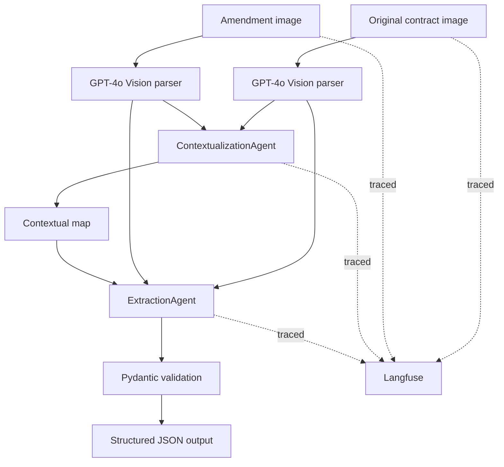

# LegalMove Contract Comparison Agent

Autonomous multi-agent pipeline that compares a scanned original contract against a scanned amendment, extracts the legal changes, validates the result with Pydantic, and traces the full workflow with Langfuse.

## Problem

LegalMove receives large volumes of amended contracts. Compliance teams lose time reading both versions manually, identifying changed clauses, and preparing a structured report for downstream systems. This project automates that workflow end to end.

## Architecture



## Why this design

1. GPT-4o Vision is used only where multimodality is necessary: reading scanned contract images.
2. The first agent does not extract changes. It only builds structure and alignment, which reduces confusion in the second step.
3. The second agent works on a clearer comparison space and can focus on additions, deletions, and modifications.
4. Pydantic closes the pipeline with a strict contract so the final output is machine-safe.
5. Langfuse provides operational traceability for debugging, audits, and the live defense.

## Project structure

```text
AEM4-Proyecto Final/
├── data/test_contracts/
├── src/
│   ├── agents/
│   │   ├── contextualization_agent.py
│   │   └── extraction_agent.py
│   ├── config.py
│   ├── image_parser.py
│   ├── main.py
│   ├── models.py
│   └── observability.py
├── .env.example
├── requirements.txt
└── README.md
```

## Setup

Recommended runtime: Python 3.12.

This repository was verified locally with Python 3.12. On Python 3.14, some dependencies such as `pydantic-core` may try to compile from source and fail on Windows.

1. Create a virtual environment.
2. Install dependencies.
3. Copy `.env.example` to `.env` and fill in your keys.

```powershell
python -m venv .venv
.\.venv\Scripts\Activate.ps1
pip install -r requirements.txt
Copy-Item .env.example .env
```

Required environment variables:

```env
OPENAI_API_KEY=your-openai-key
OPENAI_VISION_MODEL=gpt-4o
OPENAI_AGENT_MODEL=gpt-4o-mini
LANGFUSE_PUBLIC_KEY=pk-lf-xxx
LANGFUSE_SECRET_KEY=sk-lf-xxx
LANGFUSE_BASE_URL=https://cloud.langfuse.com
```

## Usage

Example with the first test pair:

```powershell
python src/main.py data/test_contracts/documento_1__original.jpg data/test_contracts/documento_1__enmienda.jpg --output output_samples/case_1.json
```

The command prints the validated JSON and stores it on disk.

## Langfuse trace design

The root trace is `contract-analysis` and it contains four child spans:

```text
contract-analysis
├── parse_original_contract
├── parse_amendment_contract
├── contextualization_agent
└── extraction_agent
```

Each span stores:
- input payload
- output payload
- token usage when available
- metadata such as selected model or saved output path

## Step-by-step pipeline explanation

### 1. `parse_contract_image()`

Receives a file path, validates the extension, reads the bytes, encodes them in base64, and sends the image to GPT-4o with a prompt that asks for faithful transcription. This is where the multimodal reasoning happens.

### 2. `ContextualizationAgent`

Receives both parsed texts and creates a comparison map. This agent answers: which sections align, which clauses look unchanged, and where changes are likely happening.

### 3. `ExtractionAgent`

Receives the contextual map plus both source texts. It isolates the actual legal differences and returns JSON only.

### 4. Pydantic validation

`ContractChangeOutput.model_validate_json()` guarantees the final answer contains:
- `sections_changed`
- `topics_touched`
- `summary_of_the_change`

If the JSON is malformed or incomplete, the pipeline fails loudly instead of producing unsafe output.

### 5. Langfuse instrumentation

The orchestrator wraps every major step in a parent-child span hierarchy. This lets you inspect exactly what was parsed, what the first agent inferred, what the second agent extracted, and how many tokens each step consumed.

## Suggested live defense flow

1. Explain the business problem: manual contract review does not scale.
2. Show one simple pair and one complex pair.
3. Run the CLI live and show the JSON result.
4. Open Langfuse and explain the root trace and child spans.
5. Justify why two agents are better than one: separation of responsibilities reduces prompt overload and makes debugging easier.
6. Close with Pydantic: no unvalidated output reaches downstream systems.

## Technical decisions you should be ready to defend

### Why GPT-4o for parsing?

Because the input is scanned imagery, not clean text. GPT-4o gives multimodal extraction without needing a separate OCR stack.

### Why two agents?

Because the tasks are different. Mapping document structure and extracting legal deltas are not the same cognitive operation. Splitting them improves control and observability.

### Why Pydantic?

Because downstream systems need a guaranteed schema, not approximate prose.

### Why Langfuse?

Because production AI systems need auditability: inputs, outputs, timing, token usage, and failure analysis.

## Demo scenarios already available

- Pair 1: software license with term, payment, support, termination, and new data-protection clause.
- Pair 2: consulting agreement with expanded scope, fee change, cadence change, and new IP clause.
- Pair 3: SaaS contract with pricing, uptime, and support changes.